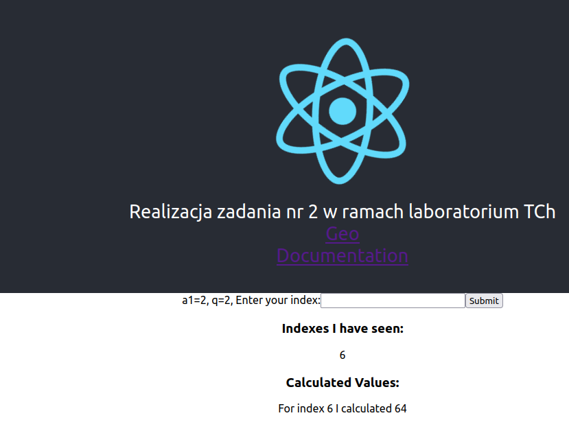

# Przesłanie obrazów

Obrazy zostały przesłane na Dockerhub, poniżej użyte komendy dla jednej mikrousługi

```bash
docker build -t worker .
docker tag worker kubusz/zad2:worker
docker push kubusz/zad2:worker
```

Link do DockerHub'a: [DockerHub](https://hub.docker.com/repository/docker/kubusz/zad2)

## docker-compose.yml
Wykorzystanie obrazów z DockerHub'a


## Uruchomienie usługi

```bash
docker compose up -d
```

## Działanie usługi


