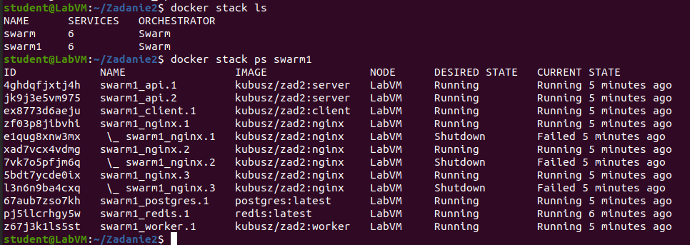
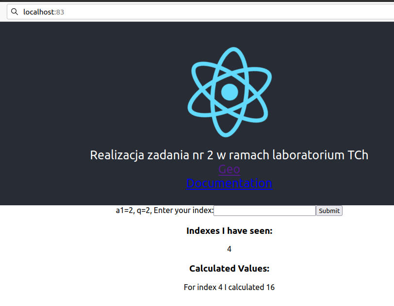

# Inicjalizacja klastra
```bash
docker swarm init
```
## Uruchomienie usług
```bash
docker stack deploy -c docker-stack.yml swarm1
```
Do każdej mikrousługi zostały dodane deploy określające replikacje czy restart




## Działanie


